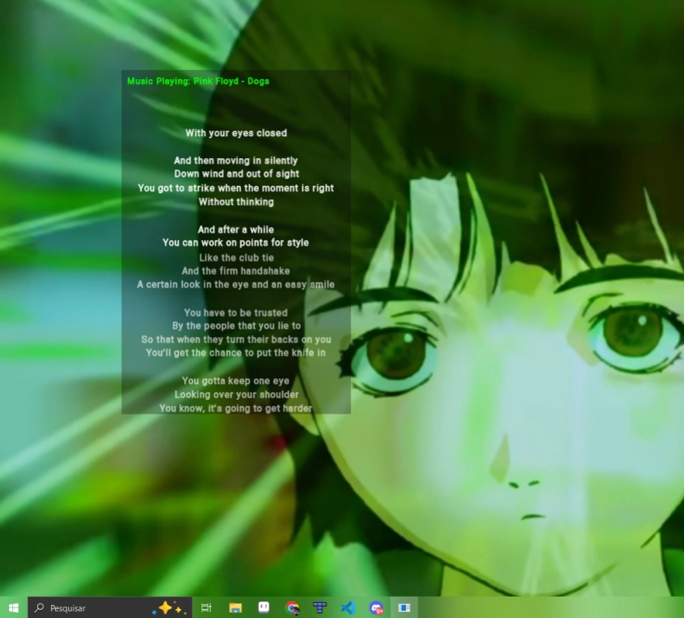

# Lyric Overlay



**A simple C++ desktop application for displaying real-time lyrics over your screen.**

## About
LyricOverlay is a lightweight program that fetches the currently playing track from **Spotify** and displays the lyrics as an overlay. It runs in the background and stays on top of other applications. There's only support for Windows, but the project might be cross-plataform in the future.

## Support
- Only Windows.

## Features
- **Spotify Integration** – Fetches the current song in real-time (1s).
- **Lyrics Display** – Shows lyrics in a transparent overlay.

## Dependencies
- **C++** – Core language
- **SFML** – Handles window rendering and text display
- **Official Spotify Web API** – Retrieves current track information
- **Lyrics API** – Fetches lyrics for the current track

## Lyrics API Integration

LyricOverlay does **not** fetch lyrics directly from Spotify or any official Spotify API. Instead, you must provide your own lyrics API endpoint. By default, you can use [spotify-lyrics-api](https://github.com/akashrchandran/spotify-lyrics-api) or any other lyrics API, as long as it returns data in the same format as the Spotify Web API's lyrics endpoint.

**Setup:**
1. Deploy or choose a lyrics API (such as [akashrchandran/spotify-lyrics-api](https://github.com/akashrchandran/spotify-lyrics-api)).
2. Set the `LYRICS_API_ENDPOINT` environment variable in your `start.bat` to point to your chosen API.

Example:
```bat
set LYRICS_API_ENDPOINT=http://localhost:3000
```

> **Disclaimer:**  
> Using the [akashrchandran/spotify-lyrics-api](https://github.com/akashrchandran/spotify-lyrics-api) or similar services may violate Spotify's Terms of Service. Use these APIs at your own risk. LyricOverlay itself does not violate any Spotify terms; it only displays lyrics fetched from an external API endpoint that you provide.

## Installation

### 1. Install Dependencies
- Install **SFML**
- Get **Spotify API credentials**
- (Optional) Get a Lyrics API key

### 2. Clone the Repository
```bash
git clone https://github.com/yourusername/LyricOverlay.git
cd LyricOverlay
```

### 3. Build & Run (Windows)

Clone vcpkg and install curl and openssl
```bash
git submodule update --init --recursive
cd vcpkg
./bootstrap-vcpkg.bat
./vcpkg.exe install
```
Add your spotify credentials in the start.bat 

```bash
set CLIENT_ID=your-client-id
set SECRET_KEY=your-secret-key
```

Compile using CMake
```bash
cmake -B build -S . "-DCMAKE_TOOLCHAIN_FILE=./vcpkg/scripts/buildsystems/vcpkg.cmake"
.\start.bat
```

## Roadmap
- **Minimal UI** – Simple and non-intrusive.
- **Spotify Integration**

## Contributing
Contributions are welcome. Open an issue or submit a pull request.

## License
GPL 3.0 - A free software

---
